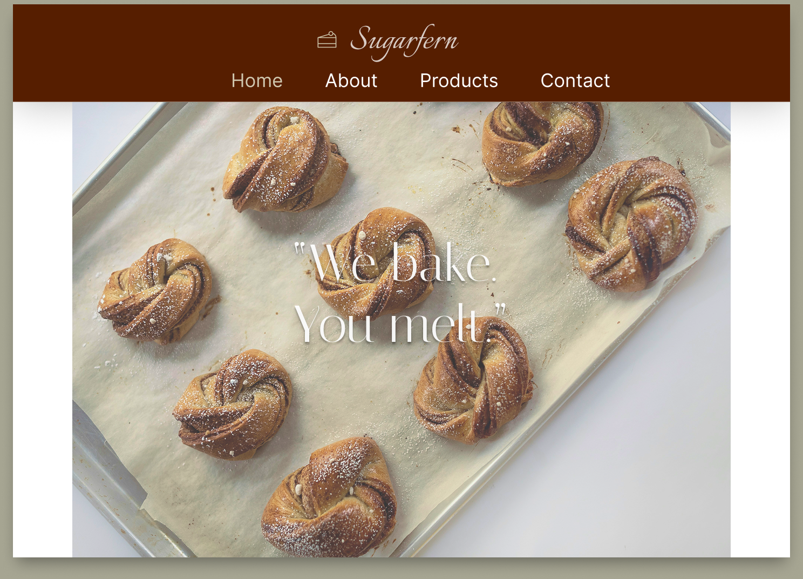

# 🍞 Sugarfern – Bakery Landing Page UI (Figma)

This is a simple, aesthetic bakery website landing page I designed on **Figma** as part of my UI/UX and front-end development learning journey.

I’m currently learning the foundations of web design, and this is one of my early hands-on attempts to improve my visual design skills and understand layout structure, typography, and component placement.

---

## 🔍 Project Highlights

- Designed in **Figma** (first project)
- Clean, minimal header with navigation
- A soft color palette and brand-style typography
- Custom branding with the name **Sugarfern**
- Focused on building user-friendly, visual-first landing pages

---

## 🖼️ Design Preview

## 🔗 View on Figma

[Click here to view the design in Figma](https://www.figma.com/design/DfFbRj1qeS2XbybsSF7nOM/Bakers-Website?node-id=0-1&t=xNh9fGsrUvr6AKsj-1)

## ✏️ What's Next

- Recreating this design using **HTML** and **CSS Grid**
- Building responsive versions
- Exploring component libraries and interaction states

---

## 📌 About Me

I'm a self-driven learner currently diving into front-end development and UI/UX design. This project is one of the many hands-on exercises I’m doing to improve my practical skills and build a strong portfolio.

Let’s connect: [LinkedIn](www.linkedin.com/in/rishika-singh-66003227a)

